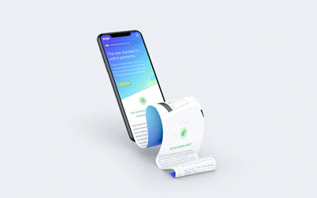

# Scrolling 4ever | Infinite scroll 

This app is looking to replicate current social media function of infinite scroll. As the user scrolls towards the bottom of the page, then another network request is made, but this happens before the user actually reaches the end of the page. The effect is, the additional content material is uploaded to the webpage in a seamless manner and giving the illusion of an infinate scroll.   

## Demo
Link to the [live](https://spagettileg.github.io/scrolling-4ever/) website hosted in GitHub Pages 

Link to [GitHub](https://github.com/Spagettileg/scrolling-4ever) Repo

***

    

